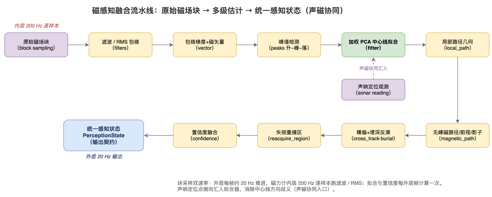
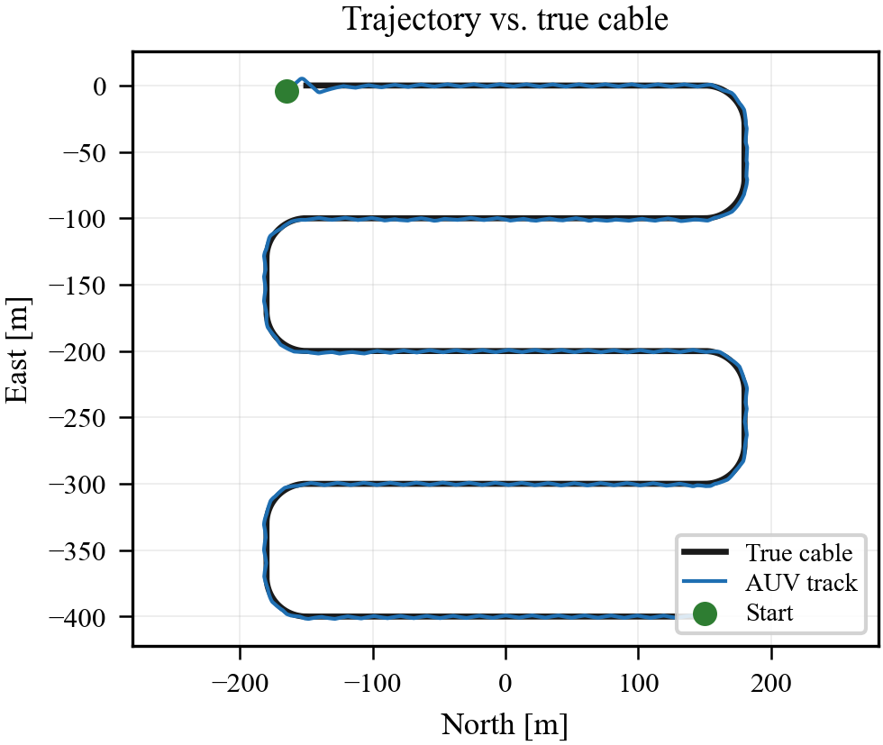
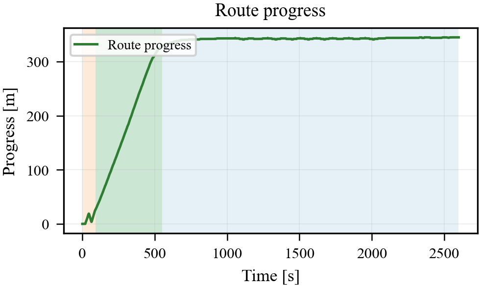
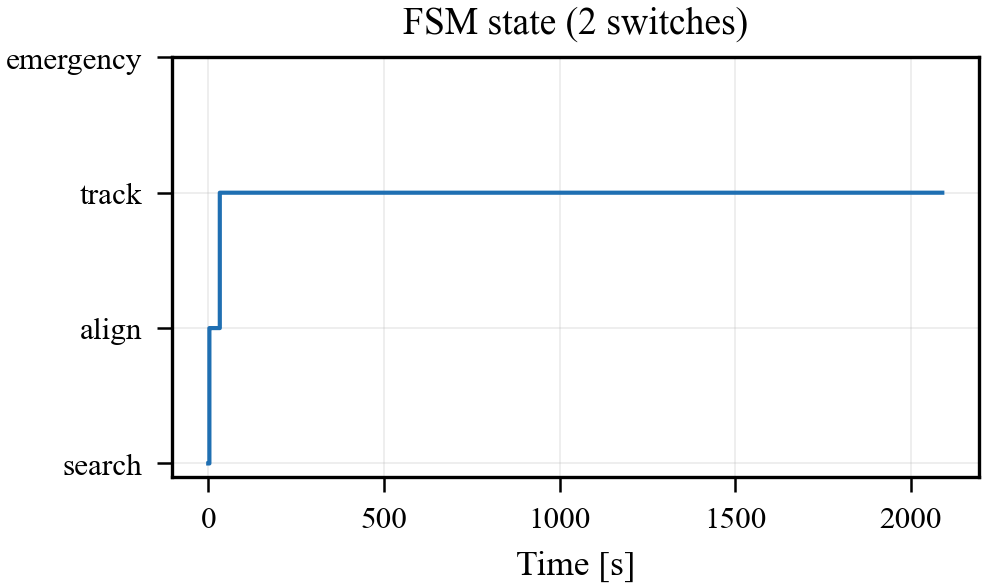

# 声磁协同电缆跟踪：背景与方法论（论文写作稿）

> **定位**：本文是声磁协同电缆跟踪研究的**自包含方法论叙述稿**，面向毕业论文正文写作。它把分散在工程文档中的机制、约束与设计动机重新组织为可直接复述的连续文本，读者无须先理解历史实验编号即可读懂"系统为什么这样设计、各层如何分工"。本文与 [docs/29 实验与结果](29_声磁协同实验设计与结果.md)、[docs/30 意义与展望](30_声磁协同意义与展望.md) 构成一组三篇写作稿，分别对应论文的方法、实验、讨论三部分。
>
> **图片约定**：本文引用两类插图，均随版本库存放于 `figure/` 目录，以相对路径 `figure/...` 引用。其一是**概念示意图**（系统架构、感知流水线、主动感知原理、任务状态机），由矢量绘图工具绘制，论文排版时可直接导出矢量格式。其二是**实测结果图**，为 IEEE 单栏宽度（约 3.5 英寸）的单面板小图，由统一可视化入口离线生成（源数据在版本库外的 `results/` 目录，已被 `.gitignore` 忽略），凡被本组写作稿引用者已随同名 PDF 一并纳入 `figure/` 以保证版本库自包含。本文图号在篇内自包含、顺序编排。

---

## 1. 研究背景

### 1.1 任务与挑战

海底电缆的巡检与维护要求自主水下航行器（AUV）能够长时间、连续地沿电缆路径跟踪前进。与开阔水域的路径跟随不同，电缆跟踪的难点在于"被跟踪对象本身的位置是不确定的"：电缆可能部分裸露、部分掩埋，铺设走向也会随海床地形发生平移、旋转与局部弯折。AUV 既要估计自身在惯性系中的位姿，又要估计电缆相对自身的几何位置，二者缺一不可。

AUV 携带的两类核心传感器各有局限。声呐能够直接给出电缆的相对位置，但前提是电缆暴露在水体中、且回波质量足够；一旦电缆被掩埋或回波丢失，声呈现"沉默"。磁力计是被动传感器，不依赖电缆暴露，但单帧磁场强度并不直接告诉系统"电缆中心线在哪里"——磁异常表现为一条随横向距离变化的场强曲线，只有当航行器横切电缆时才会产生可解释的峰值、过线相位与横偏证据。若航行器始终平行于电缆直线前进，横向激励不足，磁链路几乎"看不见"电缆。

由此引出本研究要回答的核心工程问题：**在声呐时有时无、磁信号需要主动激励才可观测的条件下，如何让 AUV 在带有自定位漂移的情况下，仍然稳定、连续地沿电缆几何前进。**

### 1.2 被动感知的局限与主动感知激励的思路

传统跟踪系统把传感器当作被动信息源——传感器给什么就用什么。但在磁跟踪场景下，传感器的信息量本身取决于航行器的运动模式：横切越充分，磁证据越丰富；横切越剧烈，任务推进越受损。这构成一对此消彼长的矛盾。

本研究因此引入**主动感知激励**的设计理念：通过有意识地调度航行器的横向运动，向磁传感链路注入足够的观测激励，使系统获得可解释的过线与局部几何证据。这不是无约束的之字形搜索，而是一种**受控的观测激励**——在不显著损害路径推进的前提下，按需安排横向运动。后文将说明这一理念如何落实为受限的之字形探测机制。

### 1.3 研究的真实结构：两套证据、一条叙事

需要明确的是，本研究的成果与既有的硬件控制/平台论文分属两套独立的实现体系。既有论文以全状态误差卡尔曼滤波（ES-EKF）叙述声磁协同状态估计，并配套行为树、PID/PVS 与不确定性感知的模型预测控制；本研究则聚焦于"给定带漂移的自定位输入后，如何稳定跟踪电缆几何"，其证据来自一套独立的仿真与诊断体系。两者的"合龙"是**论文叙事层面的整合**，而非代码合并。

这一区分对论文写作至关重要：它决定了本研究的结论应当作为既有方法论的**深化与证据补充**接入，而不是另起炉灶，更不能把两套体系混为一谈或互相矛盾地声称（详见第 2 节的两级估计框架）。

---

## 2. 方法论：两级估计的统一框架

### 2.1 核心命题——两级估计不冲突，而是上下游

本研究方法论的核心命题是：载体级的全状态滤波与电缆几何级的在线修正解决**不同层级**的问题，组合起来恰好构成完整链路。前者回答"AUV 自己在哪、朝向哪、有多大把握"，后者回答"电缆在哪、AUV 相对电缆偏多少"。

```
┌──────────────────────────────────────────────────────────┐
│ 载体级估计（全状态滤波）                                    │
│   输入：IMU + 多普勒测速 + 深度 + 声磁观测                   │
│   输出：AUV 位姿（位置/姿态/速度/零偏）+ 协方差 → 标量置信度 │
│   回答："AUV 自己在哪、朝向哪、有多大把握"                   │
└──────────────────────────┬───────────────────────────────┘
                           │ 含残余漂移的导航位姿
                           │ 作为下游"自定位"输入
                           ▼
┌──────────────────────────────────────────────────────────┐
│ 电缆几何级估计（本研究：航线先验在线修正）                   │
│   输入：名义航线先验 + 声呐/局部路径观测 + 导航位姿          │
│   输出：在线修正先验的平移/旋转/缩放 → 控制器消费的路径缓存   │
│   附加：几何安全约束层 + 主动感知激励层                      │
│   回答："电缆在哪、AUV 相对电缆偏多少"                       │
└──────────────────────────────────────────────────────────┘
```

一个关键论点是：本研究中模拟"航位推算/惯导慢漂"的导航代理，正是"载体级滤波输出的导航位姿含残余漂移"的**仿真代理**。换言之，本研究**不重复实现载体级滤波**，而是假设上游已有滤波器提供带漂移的导航位姿，把精力集中在"在此输入下如何稳定跟踪电缆几何"这一被既有工作留白的环节。这样，两级估计在论文中各司其职、互不僭越。

图 1 从软件分层的角度给出系统的整体架构：自顶向下依次为可视化/编排层、控制决策层、感知融合层、环境与物理层、传感器模拟层，右侧标出每帧约 20 Hz 的闭环时序（传感器采样 → 信号特征提取 → 感知更新 → 任务决策 → 控制指令 → 载体推进）。本节讨论的两级估计正是嵌入在感知融合层与控制决策层之间的在线机制，借助这一全局视图可以看清电缆几何级修正在系统中的承上启下位置。


### 2.2 第一级——载体级估计（沿用既有框架）

载体级估计以约十五维全状态（位置、姿态四元数、机体速度、惯性测量零偏）为状态量，融合多普勒测速、深度与声磁特征，通过自适应观测噪声与协方差到置信度的映射，输出航行器自身位姿及其不确定性。本研究在叙述这一级时保持与既有方法论一致，**不引入新的状态方程**，只在两处加以利用：其一，把它的输出（带漂移的导航位姿）作为下游电缆几何级估计的输入边界条件；其二，把它的"协方差膨胀触发行为降级、置信度驱动动态航速"的理念，与本研究下游的置信度衰减机制标注为**同源理念、两套实现**，从而在不声称联合验证的前提下完成叙事对接。

### 2.3 第二级——电缆几何级在线修正（本研究核心）

电缆几何级估计是本研究的方法论主体。它不以独立的卡尔曼或粒子滤波器形式存在，而是嵌入感知编排器中的一组**在线修正机制**：在名义航线先验存在平移、旋转、缩放偏差的情况下，利用声呐/局部路径观测在线修正先验，使控制器消费的路径缓存逐步逼近真实电缆位置。

与载体级的十五维全状态不同，这一级估计的状态量只有三维——先验的平移修正（两个分量）与旋转修正。它有两种可切换的实现：一种以指数平滑增益逐帧修正，配合残差门限、单步门限与航向误差门限三重保护；另一种以三维卡尔曼滤波融合观测与过程噪声。无论哪种实现，其叙事定位都必须明确为"在载体级滤波输出之上的电缆几何级修正层"，而非一个完整的全状态滤波器。

这一级的输入是名义航线先验、声呐观测的电缆点与观测航向、观测置信度，以及一条独立于载体航向漂移的先验旋转游走通道；输出是累积的平移/旋转修正量、修正后的路径缓存，以及供几何安全约束使用的进度锚点。它在每一感知帧的顶部被调用：先按当前航行器位置推进进度锚点，再用本帧声呐读数更新平移与旋转修正。控制器侧不再各自维护一份投影，而是统一向感知编排器请求"修正后且受几何安全约束的路径缓存"，从而保证全系统只有**单一权威的几何来源**，避免控制层与感知层各自修正导致的逻辑冲突。

图 2 给出电缆几何级修正所依托的磁感知融合流水线：原始磁场块经滤波/包络、磁矢量航向、峰值检测后进入加权 PCA 中心线拟合，再派生出局部路径几何、横偏与埋深、置信度融合，最终汇成统一的感知状态输出契约。值得注意的是声呐定位观测从侧向汇入拟合器——这正是声磁协同的入口：声呐为中心线提供绝对方向，消除纯磁拟合固有的方向歧义。该流水线内层以约 200 Hz 逐样本运行滤波，外层每帧约 20 Hz 输出一次，电缆几何级修正即工作在这一外层输出之上。



图 3 给出一次典型的轨迹跟踪结果：航行器轨迹紧贴真值电缆，包括多次 U 形回折，直观展示了电缆几何级估计在带漂移自定位下维持路径连续性的能力。



### 2.4 主动感知激励层——受控之字形探测

电缆几何级估计要持续收敛，离不开磁观测证据的持续供给；而磁证据的供给又依赖航行器的横向运动。第 1.2 节提出的"主动感知激励"理念，在方法上落实为一个三层结构：观测供给层（小幅之字形 + 受控探测脉冲）→ 候选选择层（旁路评估的轴线假设 + 与任务前进方向对齐的候选）→ 控制消费层（探测脉冲状态机 + 重捕获安全窗口）。

其中最关键的设计是把激进的横向探测约束为一个有限状态机：系统在正常跟踪时保持空闲并积累健康前进证据，只有当健康跟踪时长、前向路径进度与进入横偏门限**同时满足**时，才进入一次短时探测脉冲；脉冲阶段临时增大横向激励以采集磁过线证据，随后进入路径恢复阶段优先恢复推进，最后冷却，防止频繁重复探测。这样设计的原因在于历史实验揭示的矛盾——稳定基线观测证据弱但推进稳定，直接增大之字形或采用纯解耦横向控制能显著增强证据却严重脱轨。结论是：**需要在"观测激励强度"与"路径推进稳定性"之间引入时序约束，而非单纯调整之字形幅度。**

状态机另一处关键设计是"逻辑状态许可"与"控制执行许可"的分离：状态机可以进入待执行的脉冲或恢复状态，但只有当本帧环境允许时才真正输出航向指令。这一分离避免了安全门、重捕获请求与任务状态相互覆盖时产生不可解释的行为。此外，进入脉冲时冻结的横偏门限代表"本次探测的进入条件"，而非航行器当前横偏——若每帧刷新该门限，恢复过程中的瞬时横偏会把已经批准的安全窗口重新关闭，从而使有界探测无法完成。

主动感知激励的物理原理可由图 4 直观说明：航行器以小幅之字形反复横切电缆走向，每次穿越在磁场包络上形成"升–峰–落"并记录一个穿缆峰值观测点；将连续多个峰值点（必要时叠加声呐定位点）做加权 PCA 拟合，即得到局部中心线及其方向。图中同时标出了横切角与扫描间距——之字形探测的覆盖几何遵循"扫描间距等于声呐与磁有效半径中较小者两倍的 0.8 倍"这一原则，即在相邻扫描之间保留约 20% 的重叠裕度，确保覆盖不留缝隙。


图 5 展示了一次完整的之字形探测周期的实测诊断，包含探测腿的方向翻转、前向相位与横偏证据，是主动感知激励层运行的直接证据。


本研究在既有方法论"被动覆盖扫描"的基础上，补充了"主动感知激励"维度：之字形不只是被动地铺满扫描区域，更是通过有限状态机在跟踪健康时安排短时脉冲，在弱磁信号下主动提升可观测性而不破坏任务推进。

### 2.5 几何安全约束层——进度窗口投影

带漂移自定位与稀疏锚点会使路径投影面临"跨 lane 误匹配"的风险：在迷宫式往返电缆上，相邻 lane 在空间上彼此接近，一旦投影跳到相邻 lane，几何验收即告失败。为此，本研究引入几何安全约束层，将路径投影的搜索范围从全局限制到"上一帧进度附近的局部窗口"——向后保留较小窗口以容忍局部振荡，向前保留较大窗口以反映航行器主要向前运动的事实。

这一层的设计哲学可概括为一句话：**估计器修正必须慢速、受门限保护、在局部窗口内进行；全局最近点匹配在迷宫场景下不可接受。** 窗口大小的选取需要权衡——窗口过窄会在 U 弯处因候选路段不足而把投影锁死在弯道起点，窗口过宽又会重新引入跨 lane 误匹配。这一权衡的实测后果将在实验篇详细给出。需要强调的是，几何安全约束层有一个隐含假设：上一帧的投影进度是可靠的。若初始先验偏差过大导致首帧就投影到错误 lane，窗口约束反而会把错误锁死——这是该机制的固有边界，而非可通过调参消除的缺陷。

上述各层共同服从于一个任务级有限状态机，其全貌见图 6：航行器从搜索之字形扫描起步，信号迟滞锁存且连续达标后进入对齐锁定，拟合收敛后进入声磁协同跟踪；跟踪中若需重捕则进入有界区内重捕，若置信度持续跌破地板则触发不可逆的应急上浮终态。图中橙色加粗边标出了一处关键的不对称回退——跟踪转对齐时仍保留已拟合的中心线，区别于对齐转搜索的完全重搜，这一不对称设计正是为了在短暂信号丢失时避免丢弃已收敛的几何信息。


图 7 展示了路径进度随时间的累积曲线（叠加任务状态着色），是几何安全约束层维持投影连续性的实测可视化；图 8 给出有限状态机在一次实际运行中的状态阶梯，反映搜索、锁定、跟踪等阶段的真实切换节律。





### 2.6 四层统一叙事

综合上述，本研究方法论可用一句话收束：**载体级滤波回答"AUV 在哪"，电缆几何级在线修正回答"电缆在哪、AUV 相对电缆偏多少"，主动感知激励是可观测性激励层，几何安全约束是几何安全网层。** 四者构成"载体级 → 电缆几何级 + 主动激励 + 安全约束"的完整声磁协同链路。论文写作时按此分层叙述，即可在不引入矛盾的前提下，把本研究的证据自然接入既有方法论的相应锚点。

---

## 3. 写作接入约定（防止越界声称）

为保证方法论叙述的严谨性，本研究在接入既有论文时遵守三条红线：

第一，**不把电缆几何级在线修正写成全状态滤波**。它是三维修正量的在线滤波，叙述时必须明确"这是在载体级滤波输出之上的电缆几何级修正层"。

第二，**不把仿真导航代理写成真机惯导**。本研究中的导航代理是"载体级滤波残余漂移"的仿真代理，叙述时应标注其代理身份，不可声称为真实惯导实测。

第三，**不把仿真鲁棒性扫描写成端到端声磁融合定位精度实测**。本研究的证据是"给定带漂移自定位下的电缆跟踪鲁棒性"，而非端到端声磁融合定位精度；涉及统计口径时必须如实标注样本量（详见实验篇关于单次复现的声明）。

这三条红线保证了本研究与既有方法论的对接是**深化与补充**，而非重复或越界。具体的实验设计、指标体系与实测结果，见 [docs/29 实验与结果](29_声磁协同实验设计与结果.md)；研究的意义、独创价值、不足与展望，见 [docs/30 意义与展望](30_声磁协同意义与展望.md)。
