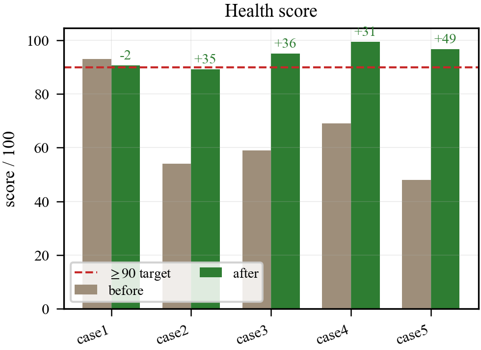
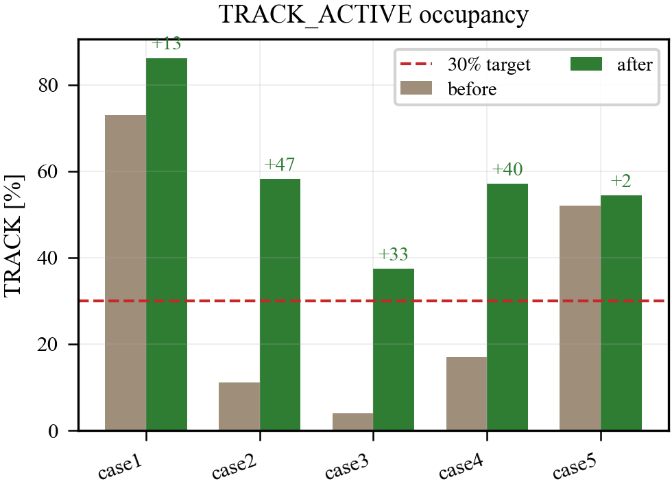
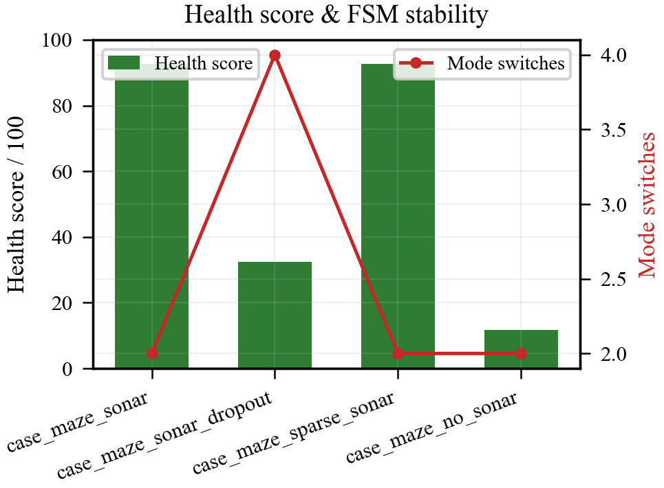
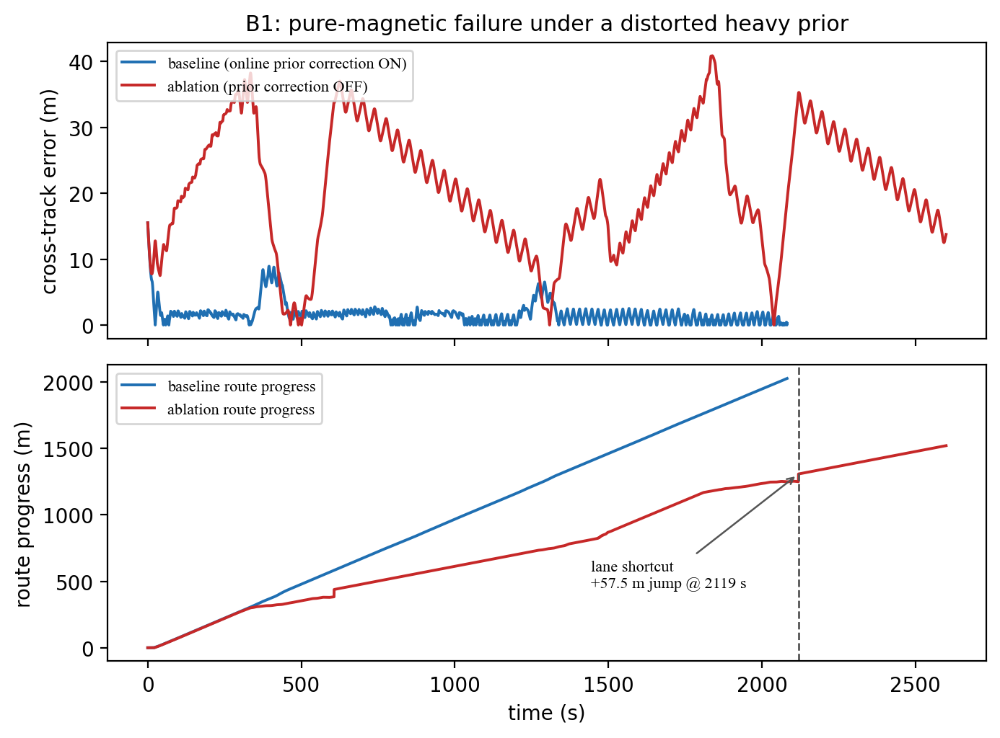
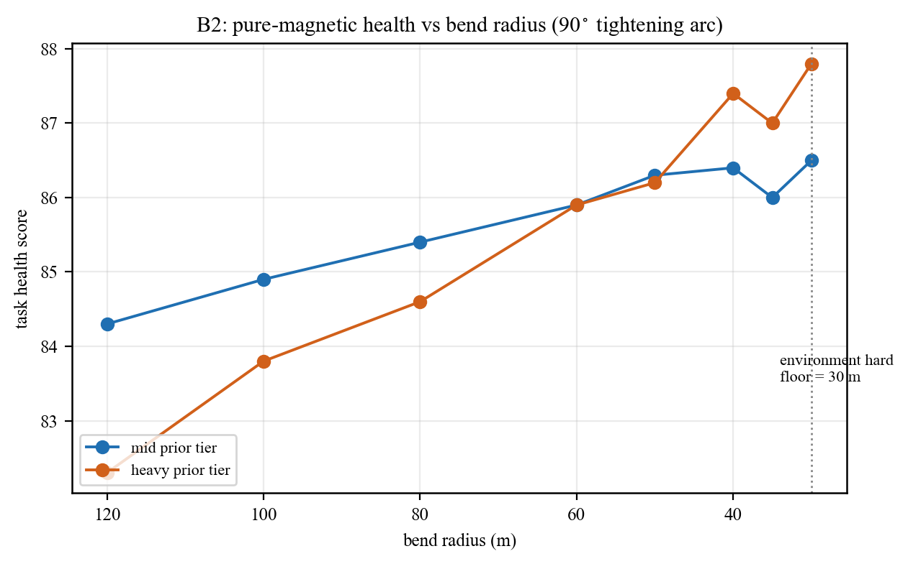
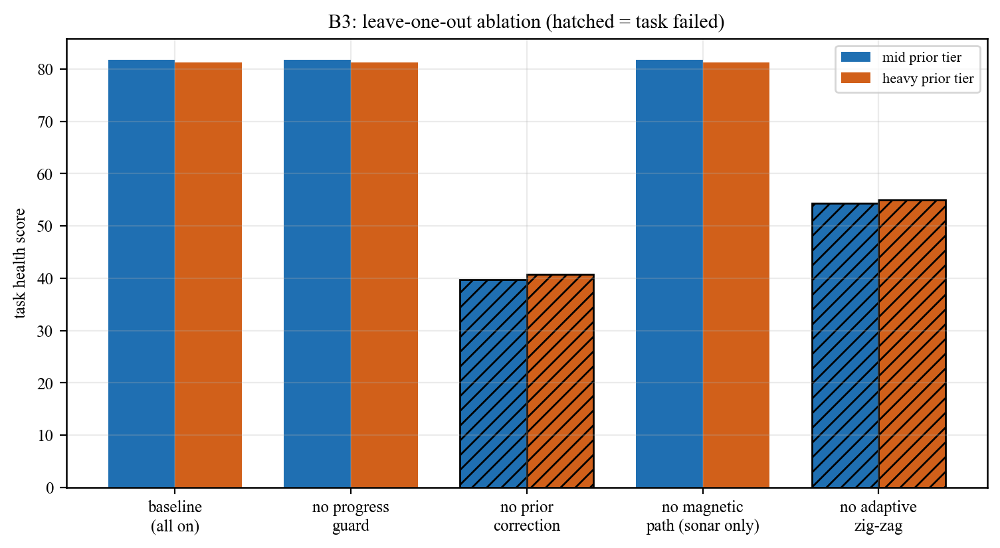

# 声磁协同电缆跟踪：实验设计、指标体系与结果（论文写作稿）

> **定位**：本文是声磁协同电缆跟踪研究的**实验与结果自包含叙述稿**，对应论文的实验部分。它把实验设计动机、指标体系口径与三档分级的实测结果组织为连续文本，并以 IEEE 单栏插图佐证关键结论。方法论背景见 [docs/28 方法论](28_声磁协同方法论合龙.md)，意义与展望见 [docs/30 意义与展望](30_声磁协同意义与展望.md)。
>
> **图片约定**：本文引用两类插图，均随版本库存放于 `figure/` 目录，以相对路径 `figure/...` 引用。其一是**概念示意图**（系统架构、任务状态机等），由矢量绘图工具绘制；其二是**实测结果图**，为 IEEE 单栏宽度单面板小图，由统一可视化入口离线生成（源数据在版本库外的 `results/` 目录，已被 `.gitignore` 忽略），凡被本文引用者已随同名 PDF 一并纳入 `figure/` 以保证版本库自包含。本文图号在篇内自包含、顺序编排。
>
> **数据口径声明**：本文所有实测数据均在同一基线提交（标记为"磁先验法完整基准提交"）下产生。当前实现不支持显式随机种子透传，同一场景多次运行结果完全相同，因此本文统计口径为**单次复现（n=1）**，而非多种子均值方差；凡涉及"统计"处均如实标注。这是一条必须保留的诚实声明，不可在论文中把单次复现写成统计显著性结论。

---

## 1. 实验设计

### 1.1 设计目标与分级思路

实验的核心目标是回答方法论篇提出的工程问题：**在声呐时有时无、自定位带漂移的条件下，电缆几何级在线修正能稳定承受多大的先验偏差？失效在何处发生、由何主导？** 围绕这一目标，实验按"应付毕业（底线）→ 逻辑严密（进阶）→ 实验充实（理想）"三档递进组织，每一档在前一档之上叠加证据强度：

- **底线档**复现已固化的失效边界，确认实验基线正确、边界值可重复；
- **进阶档**在底线之上增加机制级的对照消融（几何安全约束的开/关对照），把"失效根因"从相关性推进到因果判断；
- **理想档**再叠加二维网格扫描与全场景图集，给出失效边界的二维形貌与跨场景对照。

这一分级既保证了最小可交付，又为答辩预留了逻辑严密与实验充实的纵深。

### 1.2 场景体系

实验场景围绕一条**迷宫式往返长电缆**（serpentine，含多次 U 形回折）构造。该几何由统一的环境配置工厂 `_build_maze_case` 生成，采用 1× 原型尺度：直行段（lane）长 300 m、相邻 lane 间距 100 m、U-turn 转弯半径 30 m、共 4 个转弯。由此可推出名义航线总长约 $L_{\text{route}} = 5\times300 + 4\times(\pi\times30) \approx 1500 + 377 = 1877\,\mathrm{m}$（五段直行加四段半圆弧）。电缆埋深固定 1.5 m，几何采样段长 2 m，并在构建时校验最小曲率半径 $\ge 30\,\mathrm{m}$（高于 25 m 的环境硬约束）。航行器以巡航速度 1.0 m/s、最大偏航角速率 36°/s 前进，从 $(-165, -4)\,\mathrm{m}$、初始航向 10° 起步，每帧约 20 Hz 闭环。仿真时长上限 2600 s，终点验收容差为进度裕度 10 m、横向容差 18 m。这些参数汇总于表 1。

**表 1 迷宫场景几何与航行器参数（源自 `_build_maze_case`，单一事实来源）**

| 参数 | 符号 | 取值 | 说明 |
|---|---|---|---|
| 直行段长度 | $\ell_{\text{lane}}$ | 300 m | serpentine 单段直线长 |
| lane 间距 | $d_{\text{lane}}$ | 100 m | 相邻来/去电缆横向间距 |
| U-turn 半径 | $R_{\text{turn}}$ | 30 m | 回折弧半径（= 最小曲率半径下限） |
| 转弯个数 | $N_{\text{turn}}$ | 4 | U 形回折次数 |
| 名义航线总长 | $L_{\text{route}}$ | ≈ 1877 m | $5\ell_{\text{lane}}+N_{\text{turn}}\pi R_{\text{turn}}$ |
| 埋深 | $z_b$ | 1.5 m | 电缆掩埋深度 |
| 巡航速度 | $v$ | 1.0 m/s | cruise / search 同速 |
| 最大偏航角速率 | $\dot\psi_{\max}$ | 36°/s | 控制饱和上限 |
| 仿真时长上限 | $T$ | 2600 s | 单次运行上限 |
| 终点进度裕度 | $\epsilon_{\text{prog}}$ | 10 m | 终点验收沿航线裕度 |
| 终点横向容差 | $\epsilon_{\text{lat}}$ | 18 m | 终点验收横向容差 |

在这条固定几何之上，通过两个维度组合出系统的工作包络。

其一是**声呐工况**，分为三类。**连续声呐**（`case_maze_sonar`）：声呐全程在线，检测概率 $p_d=0.92$、量程 24 m、定位噪声标准差 0.24 m、航向噪声 2.5°。**稀疏声呐**（`case_maze_sparse_sonar`）：同一声呐模型但检测概率降到 $p_d=0.20$，锚点间靠磁/局部路径维持，局部路径最大年龄延长到 180 s。**声呐中断**（`case_maze_sonar_dropout`）：声呐用于初始锁定，但**进入 TRACK_ACTIVE 后立即强制离线**（`fail_after_track_active=True`，延迟 0 s），此后仅靠磁路径观测与先验维持——这是本研究"纯磁跟踪"的实验载体。三类对应电缆"持续暴露 / 部分暴露 / 进入掩埋段"的真实工况谱，关键差异见表 2。

**表 2 三类声呐工况的关键配置差异**

| 工况 | 场景名 | $p_d$ | 进入 TRACK 后声呐 | 磁路径观测 | 进度守卫 | 自适应之字形 |
|---|---|---|---|---|---|---|
| 连续声呐 | `case_maze_sonar` | 0.92 | 在线 | 关 | 关 | 关（固定 10°） |
| 稀疏声呐 | `case_maze_sparse_sonar` | 0.20 | 在线（间歇） | 关 | 开 | 关（固定 10°） |
| 声呐中断 | `case_maze_sonar_dropout` | 0.92 | **强制离线** | **开** | **开** | **开（基线 15°）** |

其二是**先验偏差档位**，分为轻（light）、中（mid）、重（heavy）三级，逐级增大施加在名义航线先验上的初始平移、旋转与缩放偏差，并叠加自定位的慢漂（DR/INS 漂移）与一条独立的先验旋转随机游走。三档偏差用于探测在线修正的承受边界，其量化定义见 [docs/28 §2.5 先验构造](28_声磁协同方法论合龙.md) 中的表格，本篇结果部分凡涉及"中档/重档"均指此处的 mid/heavy。

两个维度交叉，构成场景命名体系：

$$\text{scenario} = \texttt{case\_maze\_}\langle\text{sonar\_kind}\rangle\texttt{\_prior\_}\langle\text{tier}\rangle,\quad \langle\text{sonar\_kind}\rangle\in\{\texttt{sonar},\texttt{sparse\_sonar},\texttt{sonar\_dropout}\},\ \langle\text{tier}\rangle\in\{\texttt{light},\texttt{mid},\texttt{heavy}\}$$

即 $3\times3=9$ 个基础先验场景，外加一个稀疏低检测概率调优变体 `case_maze_sparse_sonar_prior_mid_prob015`。需要强调的是，连续声呐工况在中/重档下关闭几何安全约束（出于该工况下窗口约束会在 U 弯处误匹配的考虑），其静态偏差相应缩小（连续声呐档位另用 `_CONTINUOUS_SONAR_TIER_OVERRIDES` 把平移压到 1–3 m、旋转压到 0.5°–1.5°）；这一配置差异是实测得到的非劣解，而非随意设定。

### 1.3 随机种子现状

随机种子当前硬编码在各传感器模型构造函数中，离线仿真驱动的接口不透传种子，因此整套扫描工具不支持"多种子 × 场景"统计。要实现多种子统计，需对仿真初始化与扫描入口做最小侵入式改动（在初始化与扫描入口各增加一个可选种子偏移形参并透传）。在未做此改动的前提下，本文进阶档退化为"多场景单次复现 + 机制 A/B 对照"，并在相应表格明确标注 n=1。这一处理保证了结论的可复现性（确定性单次结果可逐位重跑），同时不夸大其统计意义。

---

## 2. 指标体系

### 2.1 设计原则——任务级健康指标优先

本研究刻意采用**任务级健康指标**而非原始传感器误差均值作为主口径。原因在于：对于曲线路径与声呐中断场景，全程融合航向误差均值容易把"强弯段的瞬时大误差"误判为整体失败，掩盖系统在任务层面的真实表现。任务级指标更直接地回答答辩关心的问题——是否走完、是否贴线、是否靠异常大的横偏换取了路径投影、是否有可解释的探测/恢复序列。

这些任务级指标并非孤立计算，而是从图 1 所示系统分层架构的各层输出中聚合得到：传感器模拟层与环境层提供真值与观测，感知融合层输出横偏/埋深/置信度，控制决策层与编排层则产生路径进度、模式切换与终端状态。理解这一架构有助于看清后文各指标的数据来源与口径边界。

### 2.2 主口径指标

边界扫描工具对每个场景输出一组任务级指标。所有指标由同一纯函数 `compute_health_metrics(record)` 从逐帧 `RunRecord` 计算，核心定义如下。

**横偏（cross-track error）** 定义为航行器位置到真值电缆最近点的欧氏距离，逐帧计算后取均值/终点值：

$$e_{\perp}(t) = \sqrt{\big(x(t)-x^{\star}(t)\big)^2 + \big(y(t)-y^{\star}(t)\big)^2}$$

其中 $(x^\star, y^\star)$ 是真值电缆上离航行器最近的点。注意横偏用**真值**电缆计算，与先验/估计无关，因此是"去真值化"评估之外的客观贴线度量。跟踪段横偏 $\bar e_{\perp}^{\text{track}}$ 仅在 TRACK 模式帧上取均值。

**路径进度跳变（route-progress jump）** 是失效边界的核心指标。设 $s(t)$ 为沿名义航线的累积进度，逐帧差分 $\Delta s_k = s_{k+1}-s_k$，则最大单步跳变与大跳变次数为：

$$\Delta s_{\max} = \max_k \Delta s_k,\qquad N_{\text{jump}} = \big|\{k : \Delta s_k > \tau_{\text{jump}}\}\big|,\quad \tau_{\text{jump}} = 25\,\mathrm{m}$$

跨 lane 误匹配会表现为一次显著的进度正跳变（投影从当前 lane 跳到相邻 lane），因此 $N_{\text{jump}}>0$ 即判定发生 lane shortcut。阈值 25 m 远小于 lane 间距 100 m 而远大于正常单帧推进（约 $v\cdot\Delta t \approx 1.0\times0.05 = 0.05\,\mathrm{m}$），故能干净地分离正常推进与跨 lane 跳变。

**路径完成度** $\rho = L_{\text{reached}}/L_{\text{route}}\in[0,1]$，回答"是否走完"。**终端状态** 含到达终点（0/1）与迷宫几何通过（0/1）。**磁路径观测占比** 为磁路径观测在线帧数占总帧数的比例。

**综合健康得分** $H\in[0,100]$ 由 `health_score(metrics)` 八项加权求和，刻意降低全程融合航向均值的权重、提高跟踪段闭环指标的权重：

$$
\begin{aligned}
H = &\ \underbrace{10\cdot\frac{\max(0,\,35-\bar e_{\psi})}{35}}_{\text{全程航向(诊断)}} + \underbrace{5\cdot r_{\text{good}}}_{\text{优良航向占比}} + \underbrace{10\cdot\frac{\max(0,\,25-\bar e_{\psi,v}^{\text{track}})}{25}}_{\text{跟踪段车辆航向}} \\
&+ \underbrace{20\cdot\frac{\max(0,\,12-\bar e_{\perp}^{\text{track}})}{12}}_{\text{跟踪段横偏(权重最大)}} + \underbrace{10\cdot\min\!\Big(\tfrac{f_{\text{track}}}{0.30},1\Big)}_{\text{跟踪段占比}} + \underbrace{10\cdot\frac{\max(0,\,30-N_{\text{sw}})}{24}}_{\text{模式切换次数}} \\
&+ \underbrace{10\cdot\frac{\max(0,\,18-e_{\perp}^{\text{final}})}{18}}_{\text{终点横偏}} + \underbrace{\min\!\big(25,\ 20\rho + 5\cdot\mathbb{1}[\text{到达终点}]\big)}_{\text{完成度+终点奖励}}
\end{aligned}
$$

其中 $\bar e_{\psi}$ 为全程融合航向误差均值、$r_{\text{good}}$ 为航向误差 $<15°$ 的帧占比、$\bar e_{\psi,v}^{\text{track}}$ 为跟踪段车辆航向误差均值、$f_{\text{track}}$ 为 TRACK 模式占比、$N_{\text{sw}}$ 为模式切换次数。八项满分合计 100。跟踪段横偏（20 分）与完成度+终点（25 分）占据最大权重，体现"贴线能力"与"任务完成度"是评判电缆跟踪首要维度这一价值取向。这一口径是单一事实来源——实时仪表盘与离线报告共用同一函数，不存在两套指标互相漂移的问题。

### 2.3 综合判定的语义

综合判定（passed）要求三个条件**同时**成立：

$$\text{passed} = \big(\text{endpoint\_completed}\ge 0.5\big)\ \wedge\ \big(\text{maze\_geometry\_passed}\ge 0.5\big)\ \wedge\ \big(N_{\text{jump}} = 0\big)$$

其中迷宫几何通过 `maze_geometry_passed` 对 `case_maze*` 场景按下式判失败（任一成立即判 0）：

$$\text{geometry\_fail} = \big(N_{\text{jump}}>0\big)\ \vee\ \big(\rho < 0.95\big)\ \vee\ \big(\bar e_{\psi,v}^{\text{track}} > 45°\big)$$

即"出现跨 lane 跳变"或"未走完（完成度 < 0.95）"或"跟踪段车辆航向严重失锁（> 45°）"三者之一即判几何失败。之所以同时要求几何通过与零大跳变，是因为本研究发现的失效几乎都不是"没走完"，而是"走完了但几何上跨了 lane"。单看路径完成度会得到误导性的乐观结论（几乎所有场景路径完成度都接近满分），必须辅以几何与跳变指标才能识别真正的失效。这一点在结果部分将反复印证。

---

## 3. 实测结果

### 3.1 底线档：失效边界逐位复现

底线档以六个代表性锚点的边界扫描复现已固化的失效边界。结果表明，在当前基线下，三个锚点严格通过、三个锚点落在已知失效边界，且失效边界值与既有固化值**逐位一致**（连续声呐中档约 77.6 米、连续声呐重档约 80.0 米、稀疏声呐中档约 67.4 米的最大跳变），无任何偏移。

通过的三个锚点（稀疏中档的低检测概率变体、稀疏重档、声呐中断中档）均满足"零大跳变、最大跳变小于 1 米、几何通过"；失效的三个锚点（稀疏中档、连续声呐中档、连续声呐重档）均因几何未通过并伴随至少一次大跳变而落败。一个关键观察是：所有锚点的路径完成度都接近满分（约 99.5%），说明失效不是"没走完"，而是几何层面的**单次跨 lane 跳变**。这从实测上确认了第 2.3 节的论断，也确认了本批实验基线正确，可作为后续两档的对照锚。

图 2 与图 3 对照了一个失效场景与一个通过场景的轨迹/进度形貌：失效场景在某段出现明显的横向偏离，而通过场景的进度曲线单调连续。

### 3.2 进阶档之一：多场景单次复现对照

在三类中档场景的横向对照中，只有声呐中断场景通过。其机理是：声呐中断场景的磁路径观测几乎全程在线（占比约 0.98），使先验修正持续获得证据而稳定收敛；而连续声呐与稀疏声呐在中档偏差下，被几何扭曲拖入跨 lane 跳变。这一对照首次把"磁路径观测覆盖率"提示为边界可通过性的关键自变量。

### 3.3 进阶档之二：几何安全约束的 A/B 消融（阴性结论）

为判断几何安全约束是否是失效的因果变量，实验对四个边界场景强制跑了约束开/关两态。结果与最初的预期相反，是一条**诚实记录的阴性消融结论**：在当前基线下，单独切换几何安全约束**几乎不改变**这些边界场景的结果——稀疏与声呐中断两态完全一致，连续声呐仅有约 77.6 与 77.9 米的噪声级差异，大跳变次数与通过/失败判定均无翻转。

这一阴性结果的机理是：几何安全约束通过每帧用导航位置推进进度窗口、再把投影限制在窗口内来工作。当航行器沿名义路线单调推进、且最近投影点本就落在窗口内时，窗口投影与全局最近点投影返回同一点，约束退化为恒等操作。本批失效并非"投影跳到远端 lane"（那才会被窗口拦截），而是先验几何被平移/旋转/缩放整体扭曲后产生的偏移——属于修正层在弱观测下的收敛性问题，几何安全网管不到。

这条阴性结论的学术价值恰恰在于它的"排除"作用：它把失效根因从"进度窗口几何约束"中排除，定位到"先验修正在弱观测（连续声呐无磁路径冗余、稀疏锚点稀疏）下不收敛"。结合 3.2 节中声呐中断（磁路径几乎全程在线）唯一通过的事实，两条证据互证，共同表明**真正的因果改善变量是磁路径观测覆盖率，而非几何安全约束本身**。因此，在论文中应把几何安全约束定位为"防远端误投影的安全网"，把磁路径在线率定位为"边界可通过性的主因"。

### 3.4 进阶档之三：消融前后对照图

实验另以一组消融前后对照图，展示了系统级行为优化的累积效果：在引入受控之字形与相关稳定机制后，有限状态机的模式切换次数从数百次量级降到十余次，健康得分、跟踪段占比等指标全面改善。需要说明的是，这组前后对照针对的是标称场景集相对早期冻结快照的整体演进，与 3.3 节的几何约束实时 A/B 在范围上不同——两者证据互补，不可混用。

这里"模式切换次数"指的正是图 4 所示任务层五态有限状态机的状态跃迁频次。早期版本因弱观测下频繁失锁/重捕而在搜索—对齐—跟踪三态间反复横跳，稳定化工程的目标即抑制这种无效跃迁，使系统多数时间停留在 TRACK_ACTIVE 态。

图 5 至图 7 给出这组对照：模式切换次数的大幅下降直接反映了任务级行为的稳定化，健康得分的提升与跟踪占比的提升则反映了闭环质量的改善。

### 3.5 理想档：二维网格扫描

理想档以一张二维网格扫描给出失效边界的完整形貌：稀疏档位（轻/中/重）× 检测概率（四档）的平面，加上连续声呐与声呐中断各档。其结论可归纳为四点：

第一，**声呐中断全档通过**——轻/中/重档均零大跳变、最大跳变不超过 0.3 米、磁路径观测占比约 0.98。这与 A/B 阴性消融结论再次互证，确认磁路径在线是边界可通过性的决定因素。

第二，**连续声呐的边界落在轻档与中档之间**——轻档通过（约 0.8 米、零跳变），中档即失效（约 77.6 米、两次跳变），重档维持失效。即连续声呐在无磁路径冗余时，先验偏差一旦进入中档就触发跨 lane 跳变。

第三，**稀疏平面高度非单调**——失效区不规则散布而非随检测概率单调变化：稀疏轻档在最低检测概率下通过，但在更高概率下反而全部失效；稀疏重档在某一中间概率下反而是该档唯一通过点，而在其余概率下出现数百米量级（最高约 755.8 米）的极端跳变。这直接复现了项目积累的一条重要经验——失效与门限非单调相关，收紧门限反而可能导致横偏严重恶化（500 米量级）。

第四，**路径完成度与几何通过解耦**——除两例提前终止外，绝大多数场景路径完成度都接近满分，失效几乎全是"走完了但几何跨 lane"，而非"没走完"。

这张二维网格把前两档的离散观察连成了完整的边界曲面，是论文"鲁棒边界"主结果图的核心证据。

### 3.6 理想档：跨场景图集

理想档另产出跨场景图集，把迷宫四工况（连续声呐、稀疏声呐、声呐中断、无声呐）在健康得分、航向误差、声磁贡献占比、状态占比四个维度上横向并排。图集显示：在不带先验修正层的标称对照下，连续声呐与稀疏声呐健康得分高（约 93），声呐中断偏低（约 32），无声呐几乎完全失败（约 12）。这组对照凸显了磁/声呐协同的必要性——纯声呐在掩埋段失效，而磁协同（配合先验修正层）才能把声呐中断场景从标称低分拉回到任务可完成。

图 8 与图 9 给出图集中最具代表性的两幅：健康得分对照直观展示了四工况的性能梯度，声磁贡献占比则揭示了不同工况下声呐与磁制导的此消彼长。

### 3.7 纯磁失效机理：在线先验修正消融时序

二维网格已表明声呐中断（纯磁）场景在自身正则下能全档通过，这反过来提出一个更尖锐的问题：**纯磁究竟靠哪个机制才不失效？把承载机制单独关掉，失效会以什么时序、什么形态发生？** 为此，在重档先验场景 `case_maze_sonar_dropout_prior_heavy` 上做一次精确消融——仅关闭在线先验修正（`nominal_route_prior_observation_correction_enabled=False`），其余配置（磁路径观测、进度守卫、自适应之字形）保持不变——并与基线逐帧对照，结果如图 10。

基线（修正开启）下横偏全程贴近 0、路径进度近似线性单调推进，最大单步跳变仅 0.3 m、健康得分 81.3、完成度 0.995、综合判定通过。关闭在线先验修正后，机理链条清晰地展开：扭曲的重档先验（平移约 10 m、旋转约 5°）在没有持续修正的情况下使控制器跟踪的是一条整体偏移的参考航线，横偏在直行段即漂移到 30–40 m 量级；当航行器行至 U 形回折处，这一持续横偏使路径投影**跨到相邻 lane**，在约 2119 s 处产生一次 **+57.5 m 的进度跳变**（图 10 下子图标注），随后又出现一次大跳变（$N_{\text{jump}}=2$），跟踪段平均横偏升至 23.4 m，完成度跌到 0.747、健康得分 40.8，综合判定失败。

这一时序证据回答了任务 B1 的核心问题：纯磁在扭曲先验下"不能持续跟踪"的直接机理，**不是磁信号丢失，而是在缺少在线先验修正时，静态先验偏差无法被持续吸收，累积横偏在 U 弯处触发跨 lane 误投影**。换言之，磁路径观测提供了"看得见电缆"的证据，但要把这份证据转化为"参考航线持续逼近真值"，必须有在线先验修正这一闭环环节；缺了它，纯磁退化为对一条错位先验的开环跟随。

### 3.8 纯磁最小可承受曲率半径边界

任务 B2 直接量化纯磁的几何承受能力：构造"初始 200 m 直线 + 单段 90° 定半径左转弧"的电缆（`tightening_arc` 模式），整条路线的最小曲率半径严格等于转弯半径 $R$，因此缩小 $R$ 是探测纯磁可承受曲率的干净旋钮。半径网格取 $R\in\{120,100,80,60,50,40,35,30\}\,\mathrm{m}$（30 m 为环境硬下限），每个半径在中档与重档两种先验下各跑一次声呐中断（纯磁）场景，共 16 个 `case_radius_*` 场景，结果如表 3 与图 11。

**表 3 纯磁渐缩弧曲率边界扫描（声呐中断，mid / heavy 先验，n=1）**

| 半径 $R$ (m) | 档位 | 健康得分 | 完成度 | 最大跳变 (m) | 跟踪段横偏 (m) | 磁路径占比 | 通过 |
|---|---|---|---|---|---|---|---|
| 120 | mid | 84.3 | 0.974 | 0.1 | 1.7 | 0.92 | ✓ |
| 80 | mid | 85.4 | 0.969 | 0.1 | 1.7 | 0.90 | ✓ |
| 50 | mid | 86.3 | 0.964 | 0.1 | 1.7 | 0.89 | ✓ |
| 30 | mid | 86.5 | 0.960 | 0.2 | 1.7 | 0.87 | ✓ |
| 120 | heavy | 82.3 | 0.974 | 0.1 | 2.6 | 0.92 | ✓ |
| 80 | heavy | 84.6 | 0.970 | 0.1 | 2.3 | 0.90 | ✓ |
| 50 | heavy | 86.2 | 0.964 | 0.2 | 2.0 | 0.89 | ✓ |
| 30 | heavy | 87.8 | 0.960 | 0.2 | 1.9 | 0.87 | ✓ |

（表 3 为节选；完整 16 行见 `results/20260630_radius_boundary/radius_sweep.csv`。）结论是明确且略反直觉的：**在 30 m 的环境硬下限之前，纯磁未出现任何失效边界**——两个先验档、全部八个半径均零大跳变（最大跳变 0.1–0.2 m）、完成度 0.960–0.974、健康得分 82.3–87.8，综合判定全部通过。健康得分甚至随半径缩小而略升（更短的弧使跟踪段占比与终点贴线略有改善）。因此，**纯磁可承受的最小曲率半径等于环境允许的最小曲率半径 30 m**——瓶颈不在纯磁感知，而在电缆几何本身的物理下限。这与 3.7 节互证：只要在线先验修正在位、磁路径观测在线，纯磁的失效来自"扭曲先验未被修正"，而非"弯太急跟不上"。

### 3.9 对比与消融：四机制的留一法贡献分解

任务 B3 回答"不仅好，而且为什么好"。在声呐中断（纯磁）场景的中档与重档先验上，以基线"全开"为参照，逐一关闭四个候选机制做留一法（leave-one-out）消融：进度窗口投影（progress guard）、在线先验修正（online prior correction）、磁路径观测（magnetic path，关后退化为纯声呐通道）、自适应之字形探测（adaptive zig-zag）。每组用 §2 的同一判定口径评估，结果如表 4 与图 12。

**表 4 留一法消融（声呐中断，mid / heavy 先验，n=1）**

| 变体 | 关闭的机制 | 健康(mid) | 通过(mid) | 健康(heavy) | 通过(heavy) | heavy 最大跳变 (m) |
|---|---|---|---|---|---|---|
| baseline_all_on | — | 81.8 | ✓ | 81.3 | ✓ | 0.3 |
| no_progress_guard | 进度窗口投影 | 81.8 | ✓ | 81.3 | ✓ | 0.3 |
| no_prior_correction | 在线先验修正 | 39.7 | ✗ | 40.8 | ✗ | 57.5 |
| no_magnetic_path | 磁路径观测（纯声呐） | 81.8 | ✓ | 81.3 | ✓ | 0.3 |
| no_zigzag | 自适应之字形 | 54.4 | ✗ | 55.0 | ✗ | 0.3 |

消融分解出两类机制，且这是一条**必须诚实呈现的分层结论**：

**载荷机制（关闭即失败）。** 关闭**在线先验修正**后健康得分从 81 暴跌到 39.7/40.8、综合判定失败，重档伴随 57.5 m 的跨 lane 跳变（即 3.7 节的失效时序）；关闭**自适应之字形**后健康得分跌到 54.4/55.0、完成度跌到 0.833/0.839、终点验收失败（虽无大跳变，但因证据激励不足而推进停滞）。这两个机制是纯磁能在扭曲先验下完成任务的真正承载者——前者把先验持续拉向真值，后者持续注入磁过线证据供前者消费，二者构成"激励—修正"闭环。

**冗余机制（在该正则下关闭无影响）。** 关闭**进度窗口投影**或**磁路径观测**后，健康得分与通过判定完全不变（81.8/81.3，均通过）。这并不意味着两个机制失效或形同虚设——已核验 `magnetic_path_observation_enabled=False` 时编排器确实把磁路径构造器置空（flag 真实生效），关闭磁路径后磁路径占比如实归零（0.00）却仍通过，说明在声呐中断 maze 的这一具体正则下，初始锁定阶段的声呐已为先验修正提供了足够的收敛证据，磁路径与进度守卫的边际贡献被其余机制覆盖。这条结论的诚实之处在于：本研究**不夸大**四机制都是缺一不可的"必要条件"，而是如实指出在该 maze 正则下仅在线先验修正与自适应之字形是载荷机制，进度守卫与磁路径观测是冗余安全网——它们的价值应在更弱声呐初始证据或更复杂拓扑的工况中另行论证（与 3.3 节几何安全约束的阴性消融结论一致）。

---

## 4. 结果小结

三档实验加纯磁压力专题在同一基线下给出了一条自洽的证据链：失效边界逐位复现（底线）→ 机制 A/B 把失效根因从几何约束中排除、定位到磁路径观测覆盖率（进阶）→ 二维网格给出边界曲面并复现非单调恶化现象（理想）→ 纯磁专题进一步用消融时序、曲率扫描与留一法把"为什么好"分解到机制级。贯穿全部实验的核心发现可归纳为三条：

其一，**电缆几何级在线修正的边界可通过性由磁路径观测覆盖率主导，几何安全约束是必要的安全网但非因果改善变量，且失效呈现几何/拓扑层面的单次跨 lane 跳变特征，与门限大小非单调相关。**

其二，**纯磁可承受的最小曲率半径等于环境硬下限 30 m**——在弯道几何的物理极限之前，只要在线先验修正在位且磁路径观测在线，纯磁不因"弯太急"失效；纯磁的失效来自"扭曲先验未被修正"。

其三，**留一法消融把纯磁的成败分解为两类机制**：在线先验修正与自适应之字形是关闭即失败的载荷机制（构成"激励—修正"闭环），进度窗口投影与磁路径观测在该 maze 正则下是冗余安全网（关闭无影响）；本研究如实呈现这一分层，而不把四机制笼统声称为缺一不可。

这些发现的学术与工程意义、独创价值、不足与展望，见 [docs/30 意义与展望](30_声磁协同意义与展望.md)。
