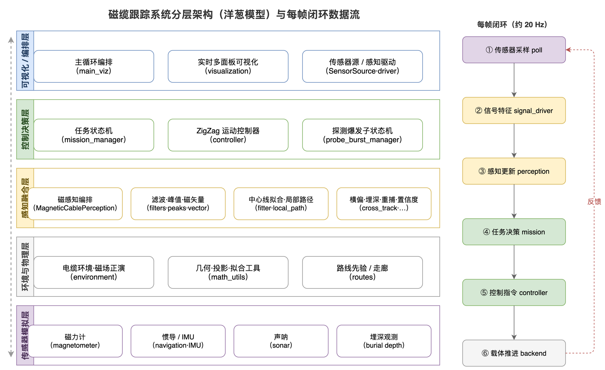
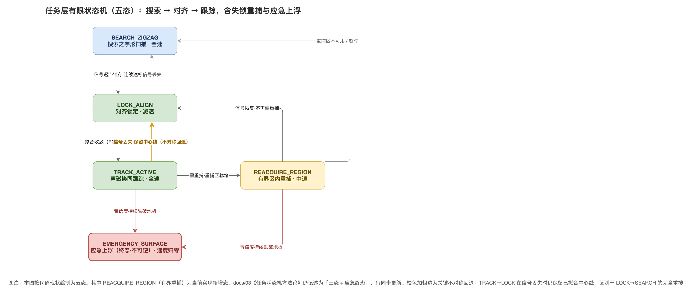
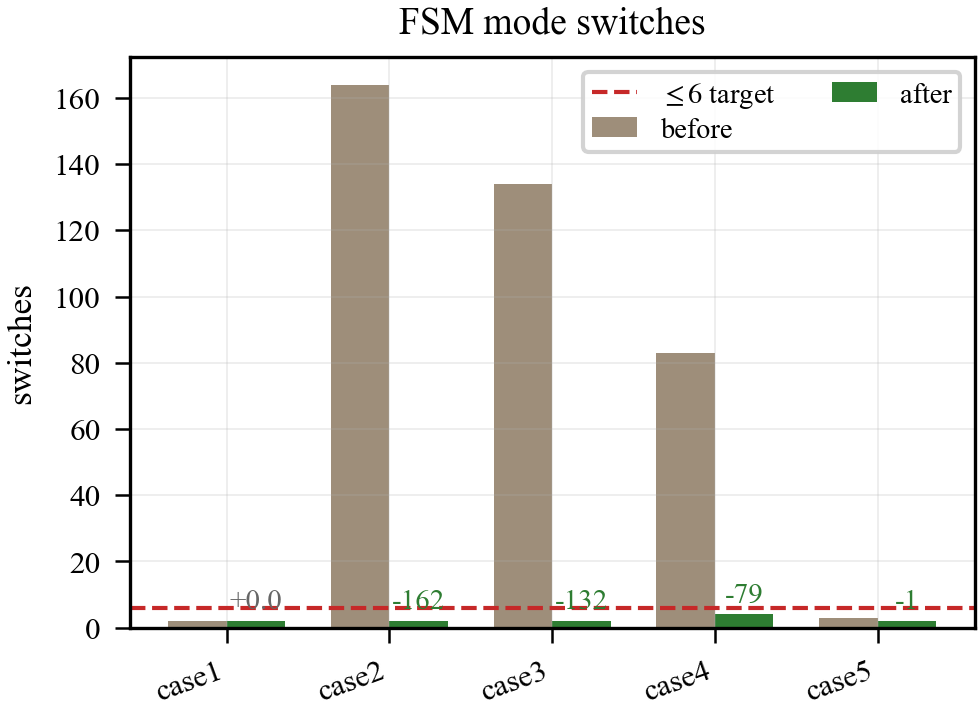
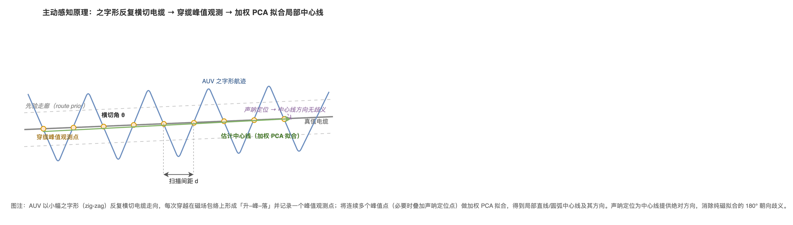
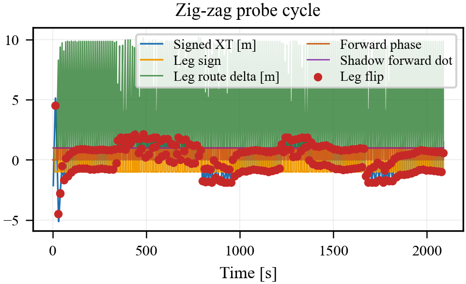
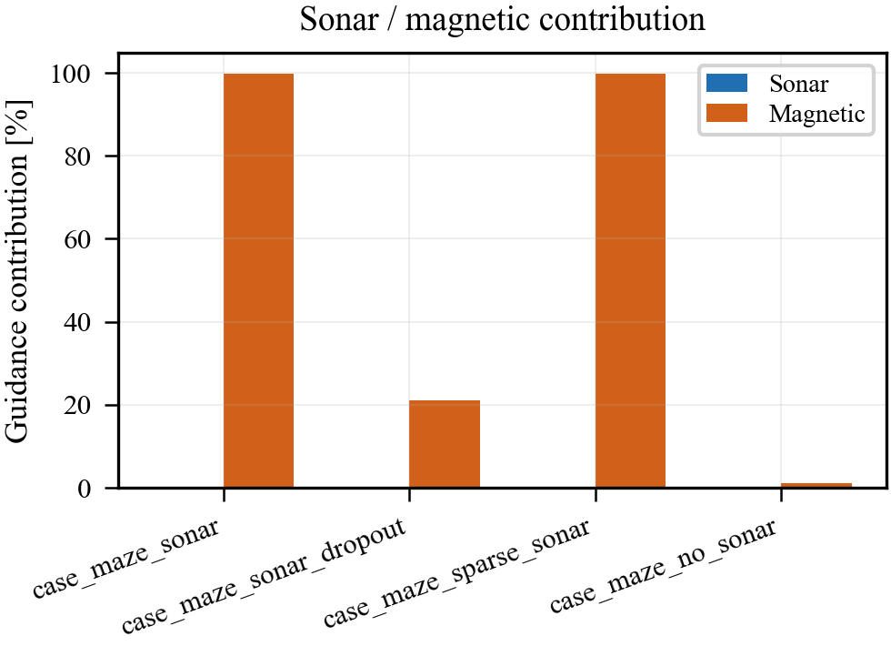

# 声磁协同电缆跟踪：学术与工程意义、独创价值与展望（论文写作稿）

> **定位**：本文是声磁协同电缆跟踪研究的**讨论与展望自包含叙述稿**，对应论文的讨论部分。它在方法（[docs/28](28_声磁协同方法论合龙.md)）与实验（[docs/29](29_声磁协同实验设计与结果.md)）的基础上，回答四个层层递进的问题——研究意味着什么、是否足够、独创价值何在、不足与未来展望如何。
>
> **图片约定**：本文引用两类插图，均随版本库存放于 `figure/` 目录，以相对路径 `figure/...` 引用。其一是**概念示意图**（系统架构、任务状态机、主动感知原理），由矢量绘图工具绘制；其二是**实测结果图**，为 IEEE 单栏宽度单面板小图，由统一可视化入口离线生成（源数据在版本库外的 `results/` 目录，已被 `.gitignore` 忽略），凡被本文引用者已随同名 PDF 一并纳入 `figure/` 以保证版本库自包含。本文图号在篇内自包含、顺序编排。

---

## 1. 学术意义

本研究的学术意义首先体现在**对状态估计问题的分层重构**。既有的声磁协同状态估计工作大多以一个全状态滤波器统揽"航行器在哪"与"电缆在哪"两个问题，把电缆几何隐含在观测模型里。本研究明确地把估计问题分成两级——载体级回答"AUV 自己在哪"，电缆几何级回答"电缆在哪、AUV 相对电缆偏多少"——并指出后者可以用一个仅三维的在线修正层独立承担，而无须扩张载体级滤波的状态维度。这一分层不仅在叙事上消除了"两套估计器互相矛盾"的隐患，更在方法上揭示了一个被既有工作忽略的事实：**电缆几何级的鲁棒性是一个独立于载体级滤波精度的问题**，即便上游给出含残余漂移的自定位，下游仍能通过几何级修正维持路径连续性。

这一分层重构在系统实现上对应图 1 所示的洋葱式分层架构：载体级估计、电缆几何级修正、主动感知激励与几何安全约束被组织为彼此解耦、自外向内逐层依赖的模块，每帧以约 20 Hz 闭环运行。正是这种"关注点分离"的架构，才使得电缆几何级修正能够作为独立层被单独研究与替换，而不牵动载体级滤波。

其次，本研究贡献了一条**关于失效根因的反事实结论**。通过对几何安全约束的开/关消融，研究得到一个与直觉相反的阴性结果：几何安全约束在单调推进场景下退化为恒等操作，单独切换它几乎不改变边界场景的成败。这条阴性结论的价值在于"排除"——它把失效根因从"几何窗口约束"中剔除，转而定位到"先验修正在弱观测下不收敛"。配合"磁路径观测几乎全程在线的场景唯一全档通过"这一正面证据，研究最终把边界可通过性的因果主因锁定为**磁路径观测覆盖率**。这种"用消融做排除、用对照做定位"的因果论证方式，比单纯报告性能数字更具方法论意义。

第三，本研究刻画了一个**非单调失效现象**。在偏差档位与检测概率构成的二维平面上，失效区不规则散布而非随参数单调变化，甚至出现"收紧门限反而导致横偏恶化到数百米量级"的反常。这一现象提示：电缆几何级修正的失效是几何/拓扑层面的歧义问题（单次跨 lane 跳变），而非可通过连续调参消除的渐进发散。把这种非单调性如实记录下来，本身就是对该问题难度的诚实刻画。

---

## 2. 工程意义

在工程层面，本研究最直接的贡献是给出了一套**可重复、可复现的鲁棒性边界**。研究明确了在何种声呐工况与先验偏差档位下系统能稳定承受、在何处失效，并给出了失效的精确数值特征（最大跳变、跳变次数）与触发条件。对于工程部署而言，这意味着可以据此为不同电缆铺设条件选择合适的工作包络，而不是盲目地把系统推到未验证的边界。

其次，本研究提出的**主动感知激励的时序约束设计**具有可迁移的工程价值。研究表明，在观测激励与任务推进的矛盾面前，正确的做法不是调整激励幅度，而是引入时序约束——用有限状态机把激进探测约束在"健康跟踪后短时脉冲、随即恢复推进"的节律内，并把"逻辑状态许可"与"控制执行许可"分离。这套设计模式对任何"感知质量依赖运动模式"的自主系统都有借鉴意义。

第三，研究在工程上确立了一条重要的架构准则：**几何修正必须由单一权威源处理**。控制层不再各自维护投影与修正，而是统一向感知层请求"修正后且受安全约束的路径缓存"。这一准则解决了早期版本中控制层与感知层双重修正导致的逻辑冲突，保证了全系统几何来源的一致性。这一准则的行为收益最终体现在任务层有限状态机上：图 2 给出系统遵循的五态状态机，单一权威源消除了控制/感知双重修正引发的状态争用，使图 3 所示的模式切换次数从数百次降到十余次——正是这类系统级稳定化工程的累积成效之一。

---

## 3. 是否足够

就一篇以电缆几何级跟踪鲁棒性为主题的研究而言，当前证据**足以支撑核心论点**：方法论上四层框架自洽、接入既有工作的红线清晰；实验上失效边界逐位复现、因果根因经消融定位、二维网格给出边界曲面；指标上采用任务级健康口径并保持单一事实来源。这些已经构成一条从机制到证据再到边界刻画的完整链条。

但"足够支撑核心论点"不等于"无可补强"。当前证据有两处明确的边界：其一，统计口径为单次复现（n=1），尚未做多种子统计；其二，所有结论建立在仿真之上，导航漂移是载体级滤波残余漂移的代理而非真机惯导实测。在毕业论文的语境下，只要如实标注这两处口径、不把单次复现写成统计显著、不把仿真写成真机实测，当前证据即满足"逻辑严密"的底线；若要达到"实验充实"的理想档，则需要按下文展望补足多种子统计与真机/半物理验证。

---

## 4. 独创价值

本研究的独创价值可凝练为三点。

**其一，两级估计的显式解耦与代理建模。** 研究不重复实现载体级全状态滤波，而是把它的输出抽象为"带残余漂移的自定位"，用一个导航代理建模，从而把研究焦点干净地切到电缆几何级。这种"承认上游、专注下游"的建模策略，使本研究能在不依赖另一套庞大代码库的前提下，独立地研究电缆几何级鲁棒性——这是与既有"大一统滤波器"叙事的本质区别。

**其二，受控主动感知激励的状态机化。** 把"之字形横切以激励磁观测"从一个被动的覆盖扫描，提升为受时序约束的主动感知激励，并通过状态许可与执行许可的分离解决多重控制源的覆盖冲突。这一设计回答了"如何在弱磁信号下主动提升可观测性而不破坏任务推进"这一具体而棘手的问题。其几何原理见图 4：航行器以小幅之字形反复横切电缆，每次穿越记录一个穿缆峰值观测点，加权 PCA 拟合得到局部中心线，声呐定位则提供绝对方向消除纯磁拟合的方向歧义；图 5 的之字形探测周期诊断则是这一机制实际运行的直接证据。

**其三，以阴性消融定位因果根因。** 研究没有止步于"加了某机制、性能变好"的相关性叙述，而是通过开/关消融主动证伪了"几何约束是因果改善变量"的假设，再用正面对照把因果主因定位到磁路径观测覆盖率。这种诚实而严谨的因果论证，连同对非单调失效现象的如实记录，构成了本研究在方法论严谨性上的独到之处。图 6 的跨场景声磁贡献占比，从另一个角度印证了声磁接力随工况退化而切换的规律。

---

## 5. 不足

本研究存在若干需要在论文中如实陈述的不足。

**统计强度不足。** 受限于当前实现不透传随机种子，所有结果为单次确定性复现，无法给出均值方差与置信区间。虽然单次结果可逐位重跑、可复现性有保证，但严格意义上不能支撑统计显著性声称。

**验证停留在仿真。** 自定位漂移是载体级滤波残余漂移的仿真代理，声呐工况与磁观测也来自仿真模型。研究尚未在真机或半物理平台上验证，因此结论是"给定带漂移自定位下的电缆跟踪鲁棒性"，而非端到端声磁融合定位精度的真机实证。

**失效边界尚未根治。** 当前已确认的失效（稀疏单次 U 弯跨 lane、连续声呐无安全约束下的大跳变）属于几何/拓扑层面的歧义问题，且与门限大小非单调相关——单纯调参不能解决。几何安全约束本身也有固有边界：它假设上一帧投影可靠，若初始先验偏差过大导致首帧误投影，窗口约束反而会把错误锁死。

**主动感知激励尚未成为默认策略。** 受控探测脉冲机制目前默认关闭，其有效门限是针对代表点标定的，不应直接声称适用于所有海缆几何；声呐中断场景的成功依赖有界安全窗口与进入横偏冻结，不能简化为"打开之字形即成功"。

**单一口径门限的代表性局限。** 研究中作为代表点的门限值（如有界安全窗口的米级门限）是在特定迷宫几何下标定的，其向其他 lane 间距、其他电缆拓扑的迁移性尚未系统验证。

---

## 6. 未来展望

针对上述不足，未来工作可沿三个方向展开。

**其一，补足统计与真机验证。** 最小的改动是让随机种子可注入，从而把当前的单次复现升级为多种子统计，给出均值方差与边界的置信区间。进一步则应在半物理或真机平台上验证导航漂移、声呐工况与磁观测，把仿真结论提升为实证结论。

**其二，针对失效根因做架构性改进而非调参。** 既然失效是几何/拓扑层面的歧义、且与门限非单调相关，未来应引入基于电缆几何拓扑（而非弧长距离）的"lane 感知投影约束"，或保留跟踪段未漂锚点作为投影偏好的"锚点置信记忆"，以根治稀疏单次 U 弯跨 lane；对连续声呐无安全约束的大跳变，则可设计"软安全约束"——不强制窗口，但对跨 lane 候选的投影距离施加惩罚。这些都属于架构性变更，需要单独立项。

**其三，强化磁路径观测覆盖率这一因果主因。** 既然研究已把边界可通过性的因果主因定位到磁路径观测覆盖率，未来应围绕"如何在弱声呐工况下持续提升磁路径在线率"展开——包括把主动感知激励从默认关闭推进为可自适应触发的默认策略，以及把磁路径与先验投影做一致性校验后再吸收，从源头上提升修正层在弱观测下的收敛性。

综合来看，本研究在方法论上完成了两级估计的解耦与主动感知激励的设计，在实验上给出了可复现的鲁棒性边界并诚实地定位了因果根因，已具备支撑毕业论文核心论点的完整性；其留白——多种子统计、真机验证、失效边界的架构性根治——则清晰地指向了后续研究的纵深方向。
