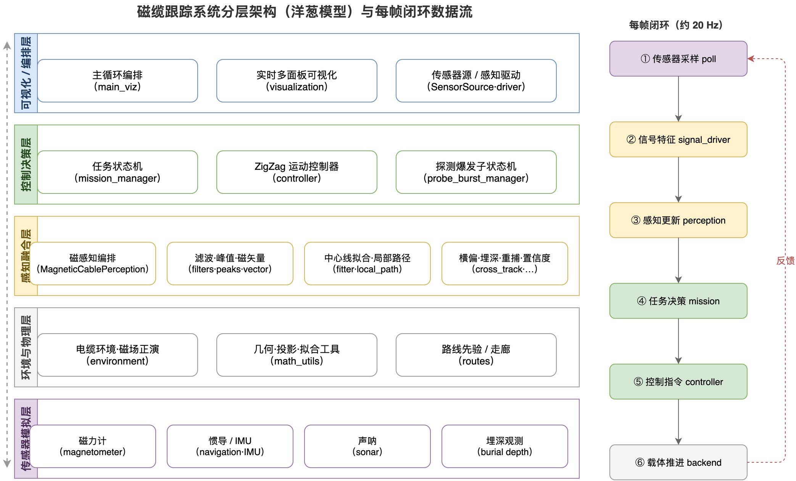
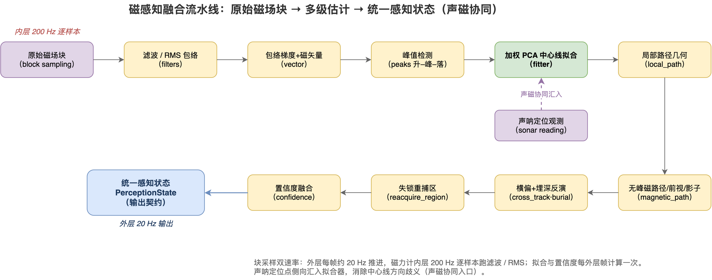
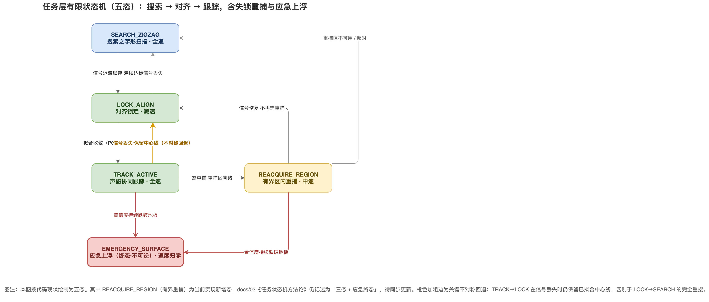
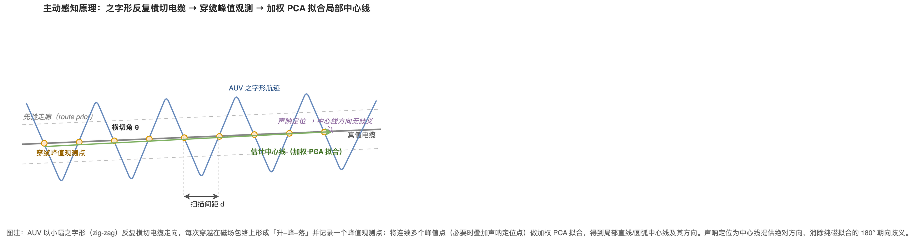
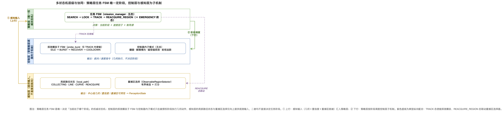

# 毕设结构与状态机图集（docs/figure）

本图集为毕业论文「系统架构」与「状态机/感知方法」两章提供可直接引用的结构图与示意图，
共 5 张，统一采用低饱和度学术框图风格、中文标注，**只呈现模块 / 状态 / 数据流的语义关系，
不陷入变量名等实现细节**。每张图均提供三种文件：

- `*.drawio`：可编辑源文件（draw.io 桌面版打开）；
- `*.drawio.png`：嵌入源 XML 的位图（论文插图用，双击可在 draw.io 还原编辑）；
- `*.svg`：矢量图（投稿 / 排版用，缩放无损）。

命名约定：`fig_<主题>`。图 1–3 为「架构 / 流水线 / 状态机」三类核心结构图，
图 4–5 为「原理示意 / 多状态机层级」两类 illustrative 补充图。

---

## 图 1　磁缆跟踪系统分层架构（洋葱模型）与每帧闭环

**Caption：** 图 1　系统分层架构（洋葱五层）与每帧约 20 Hz 的闭环数据流。

本图给出软件系统的宏观分层：由外到内依次为可视化/编排层、控制决策层、感知融合层、
环境与物理层、传感器模拟层；每一层只依赖更内层提供的契约，体现关注点分离与「去真值化」
的感知设计原则。右侧①–⑥纵向链表示一帧仿真主循环的执行顺序——传感器采样 → 信号特征 →
感知更新 → 任务决策 → 控制指令 → 载体推进，末端以红色虚线反馈回采样端，闭合为实时控制环。
读图要点：左侧分层强调「谁依赖谁」的静态结构，右侧闭环强调「每帧怎么走」的动态时序，二者
共同说明系统既模块解耦、又能以固定节拍稳定运行。该图适合放在论文系统设计章节的开篇，作为
后续各模块详述的总览。

**来源锚点：** `main_viz.py`（主循环 poll→signal_driver→perception→mission→controller→backend）；
分层与数据流见 `docs/00`。

---

## 图 2　磁感知融合流水线（声磁协同）

**Caption：** 图 2　磁感知融合流水线：自原始磁场块经多级估计汇聚为统一感知状态，声呐定位侧向汇入。

本图展开感知融合层内部的处理流水线，按蛇形顺序串接：原始磁场块（块采样）→ 滤波/RMS 包络 →
包络梯度+磁矢量 → 峰值检测（升–峰–落）→ 加权 PCA 中心线拟合 → 局部路径几何 → 无峰磁路径/前视/影子 →
横偏+埋深反演 → 失锁重捕区 → 置信度融合 → 统一感知状态 PerceptionState（输出契约）。其中加权 PCA
拟合为流水线核心（绿色高亮），声呐定位观测从侧向虚线汇入拟合器，为中心线提供绝对方向、消除纯磁
拟合的 180° 朝向歧义，即「声磁协同」的算法入口。图左上/左下标注「内层 200 Hz 逐样本」与「外层 20 Hz
输出」的块采样双速率：磁力计内层以 200 Hz 跑滤波/RMS，拟合与置信度按每外层帧计算一次。该图适合放在
感知方法章节，说明从原始信号到统一契约的端到端处理与多源融合位置。

**来源锚点：** `perception/orchestrator.py`（`MagneticCablePerception.update()` 调度链）；
拟合器、局部路径、重捕区分别见 `perception/` 下 `fitter`、`local_path.py`、`reacquire_region`。

---

## 图 3　任务层有限状态机（五态）

**Caption：** 图 3　任务层 FSM 五态转移图，含关键不对称回退（TRACK→LOCK，橙色加粗）。

本图按代码现状绘制任务层有限状态机的五个状态与全部转移：SEARCH_ZIGZAG（之字形搜索·全速）→
LOCK_ALIGN（对齐锁定·减速）→ TRACK_ACTIVE（声磁协同跟踪·全速），并由 TRACK 派生 REACQUIRE_REGION
（有界区内重捕·中速）与 EMERGENCY_SURFACE（应急上浮·终态·速度归零）。转移条件以边标注（信号迟滞
锁存、拟合收敛、信号丢失、重捕就绪/超时、置信度跌破地板等）。橙色加粗边为关键不对称回退：TRACK→LOCK
在信号丢失时仍保留已拟合中心线，区别于 LOCK→SEARCH 的完全重搜——这是系统在弱观测下保持鲁棒的核心
设计。读图要点：注意 REACQUIRE_REGION 为当前实现新增态，而 `docs/03` 仍记述为「三态 + 应急终态」，
图注已标明此差异，论文引用时应以本图（代码现状）为准。

**来源锚点：** `mission_manager.py` L29-36（`MissionState` 五枚举）、L190-260（转移逻辑）；
方法论文档 `docs/03`（记述与代码的差异见图注）。

---

## 图 4　主动感知原理：之字形穿缆示意

**Caption：** 图 4　之字形主动感知原理示意：横切取峰、加权 PCA 拟合中心线，声呐定向消歧义。

本图为纯几何示意，解释「主动感知」为何有效。AUV 沿先验走廊以小幅之字形（zig-zag）反复横切电缆
走向，每次穿越在磁场包络上形成「升–峰–落」并记录一个峰值观测点（橙色点）；将连续多个峰值点做加权
PCA 拟合，得到局部中心线（绿色箭头）及其方向。图中标注横切角 θ 与扫描间距 d 两个关键几何量，二者
共同决定观测可观测性与覆盖密度。右上紫色虚线表示声呐定位的辅助作用：为中心线提供绝对方向，消除纯
磁拟合固有的 180° 朝向歧义。该图适合放在感知方法章节作为直观引入，与图 2 的流水线形成「原理示意 +
工程实现」的互补，帮助读者在进入公式前先建立几何直觉。

**来源锚点：** 峰值检测与加权 PCA 拟合见 `perception/`（peaks、fitter）；之字形扫描由
`controller.py` 生成横切航迹；声呐消歧义对应图 2 的声磁协同汇入。

---

## 图 5　多状态机层级与协同

**Caption：** 图 5　三层状态机层级关系：策略层 FSM 为唯一权威，控制层与感知层为受调度的子机制。

本图阐明系统中多个状态机的层级与协同关系，澄清「谁说了算」这一架构关键。**策略层**的任务 FSM
（五态）是唯一决定「当前处于哪个阶段」的权威状态机；**控制层**的探测爆发子 FSM（仅 TRACK 内使能）
与控制器内子模式（翻腿/解耦横向/磁穿越探测/前视追踪）只在被授权阶段执行几何动作，输出航向/速度
指令但不决定阶段；**感知层**的局部路径状态与重捕区选择仅向上提供观测输入（中心线几何/置信度/重捕区
可用性），同样不直接决定任务阶段。图中①上行表示感知输入汇入策略层，②下行表示策略层按阶段调度控制层
子机制；两条紫色虚线为典型纵向配合——TRACK 态使能探测爆发、REACQUIRE_REGION 态联动重捕区选择器。
该图适合放在架构或方法章节，强调「单一权威源」的设计准则，避免读者误以为各子状态机各自为政。

**来源锚点：** 策略层 `mission_manager.py`（五态）；控制层 `probe_burst_manager.py` L7-13
（`ProbeBurstState` 四态）与 `controller.py`；感知层 `perception/local_path.py` L22-28
（`LocalPathTrackingState` 四态）与重捕区选择器 `ObservableRegionSelector`。
